# Four RxJS pipelines
(https://www.youtube.com/watch?v=wQ8jXlWMoCo&t=170s)

## General approach

<ul>
  <li>Before choose needed pipelines, answer the questions first:
    <ol>
      <li>What do we have?</li>
      <li>What do we want?</li>
      <li>When do we want it?</li>
    </ol>
  </li>
  <li>To respond to an action - use **Subject**/**BehaviorSubject**.
  Whenever after some action occurs and this cause RxJS stream to do smth

   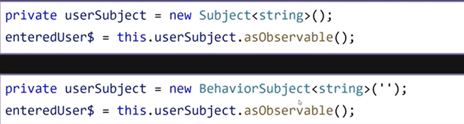 

  `Subject<string>()` - does not have initial value  
  `BehaviorSubject<string>('')` - always have initial value 
  When component subsribe to `enteredUser$` observable of `BehaviorSubject` - first it will have its default value(''). If it subsribed late after `Subject` have emitted several things - it will always give to subsribers - **last** emitted value.
  </li>
</ul>

## 1. Retrieve Related Data Pipeline (switchMap)
- **What do we have?** - Typed in search userName
- **What do we want?** - List of posts related to typed in user
- **When do we want it?** - Aby time the user changes typed in search field
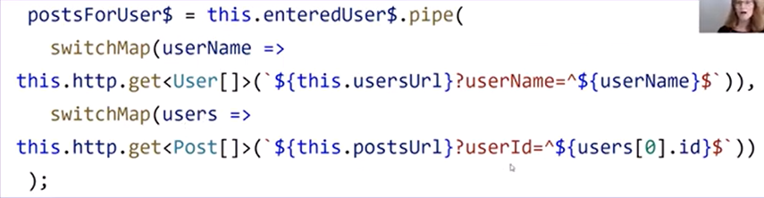 

### 1.1 Retrieve Related Data Pipeline (with error handling!)
- Retrieve related data pipeline with handling case whe user/post not found
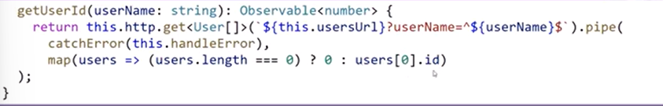 
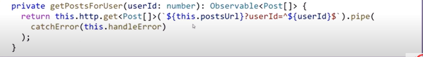 
Rewripe pipeline: 
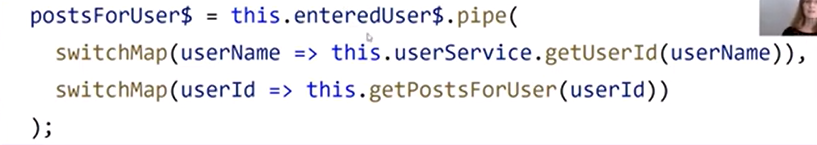 

## 2. Lookup Reference Property Pipeline (combineLatest)
To work with **multipe streams**, use a **combination** operator  
 1. Retrieve **category name** when initially we have only **categoryId**
- **What do we have?** - Post and PostCategory
- **What do we want?** - Add categoryName to the Post entity
- **When do we want it?** - Whenever we get the data
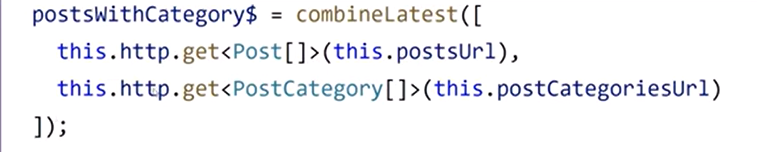 
Lets break into smaller pieces with exemption handling 
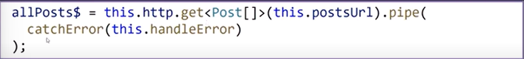 
How to reuse the Retrieved categories (since it will not change)
`shareReplay(1) - will cache the last emitted item` 
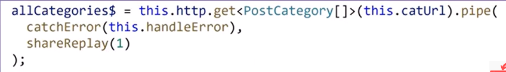 
Rewrite pipeline to: 
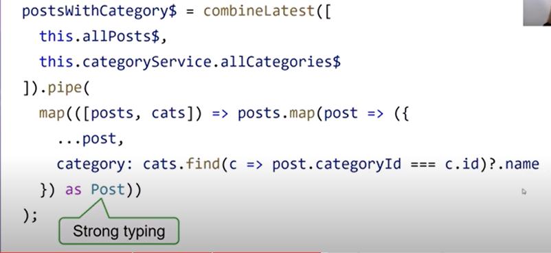 
The same pipeline splitted into methods: 
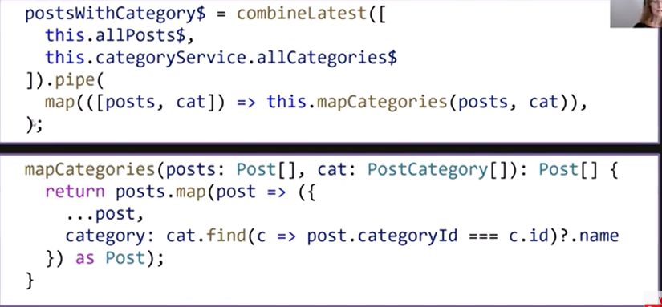 

## 3. Grouping pipeline
- **What do we have?** - Posts
- **What do we want?** - Posts groped by category
- **When do we want it?** - Whenever the data is ready for the page
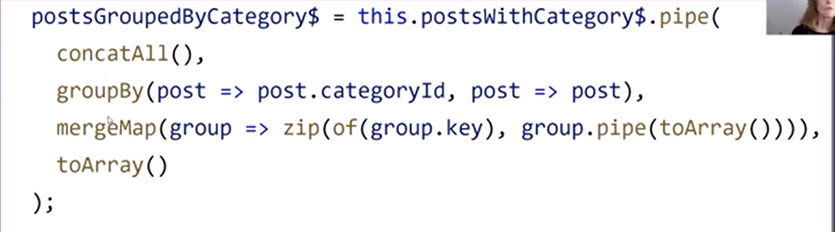 
**concatAll** 
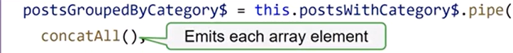 
**groupBy** 
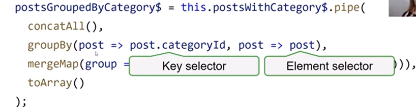 
**mergeMap** 
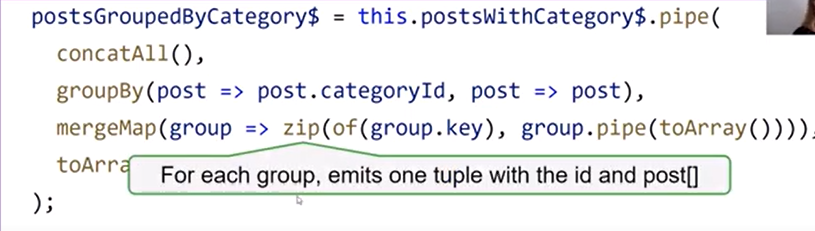 
**toArray** (to get array with all tuples and render it instead emitting by one value) 
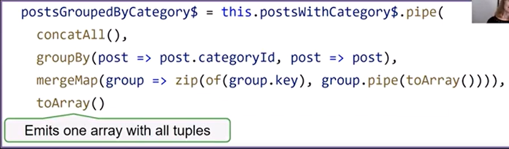 

## 4. Autocomplete pipeline
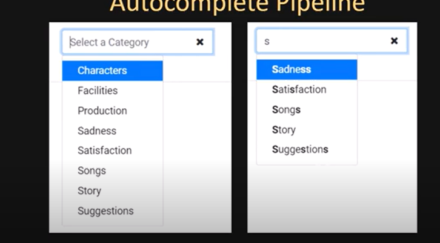 
- **What do we have?** - List of categories
- **What do we want?** && **When do we want it?**  
Type: Filter the list 
Click: Open the list 
Focus: Open the list 
Click x: Clear and open the list 
For each action we will use own `Subject/BehaviorSubject` 

Event handlers 
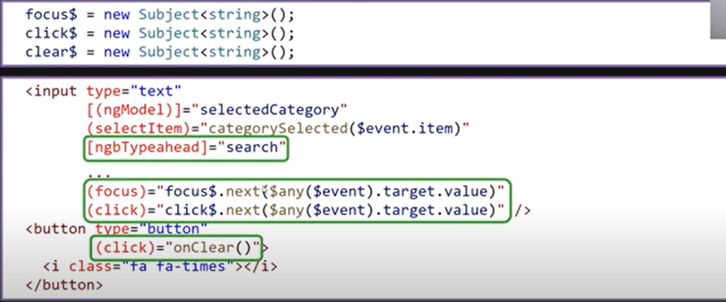 
Search func 
 
Merge all handlers in *operations$* stream 
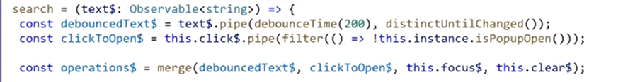 
Combine opeartions$ stream with categories to work with them together and return array of ategories whick includes types substring othetwise display whole list of categories 
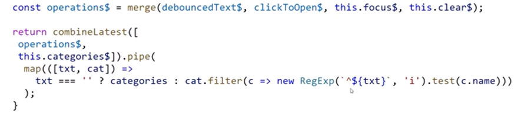 

